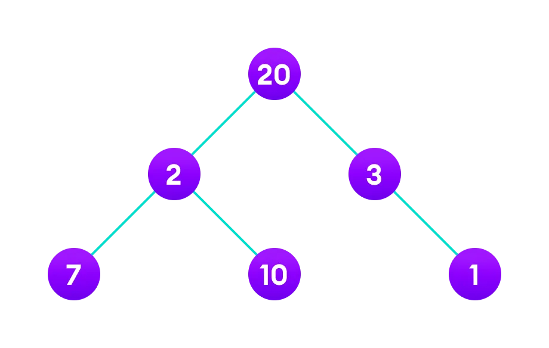

# 贪心算法讲解

## 引言

贪心算法的核心思想是通过每一步的局部最优解来达到全局最优解。本文将介绍贪心算法的原理、时间复杂度、思维框架、示例以及与动态规划的区别。

## 贪心算法原理

**关键字：贪心策略、局部最优。**

贪心算法是一种基于贪心策略的算法，也就是说，在每一步选择时，都采取当前状态下的最优策略，即局部最优解。然而，局部最优解并不一定是全局最优解。思考下面这个问题：如何找到下面这个图的最长路径？

如果用贪心策略来讲，

1. 第一步我们遍历了根节点`20`，在这个位置上，我们最好的选择是`3`，因为`3 > 2`。
2. 所以第二步我们选择了`3`，在这个位置上，我们最好的选择是`1`。该节点没有子节点，所以路径遍历完毕。
3. 但是这条路径`[20, 3, 1]`显然没有路径`[20, 2, 10]`长。

所以贪心算法的局部最优解并不一定是全局最优解。

贪心算法的适用条件是，问题的最优解可以通过局部最优解来推导出来，并且问题具有无后效性，也就是说，某个状态以后的过程不会影响以前的状态。

### 贪心算法的思维框架

贪心算法的思想在于每一步都是最优的选择，从而达到全局最优解。在实际应用中，贪心算法通常需要具备以下三个条件：

(1)  问题的最优解可以通过局部最优解来推导出来。

(2) 问题具有无后效性，后面的状态不会影响前面的状态（不可撤回）

(3) 贪心策略的选择只看眼前，不能依赖于后面的策略。

### 贪心算法和动态规划的区别

动态规划的思维框架是确认状态和状态转移方程，求解过程中需要保存中间结果来降低时间复杂度。贪心算法不需要保存结果，而是通过从底向上的每一步最优达到全局最优。

## 参考资料

1. <https://www.geeksforgeeks.org/greedy-algorithms/>
2. <https://www.freecodecamp.org/news/greedy-algorithms/>
