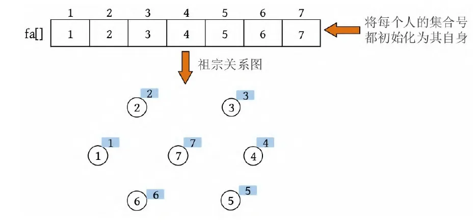
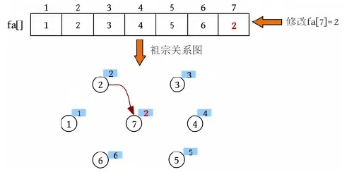
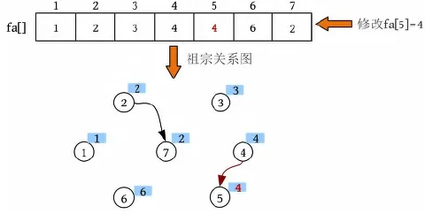
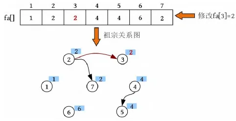
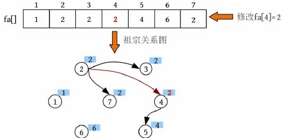
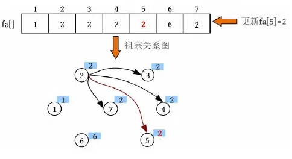
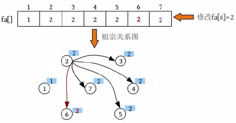
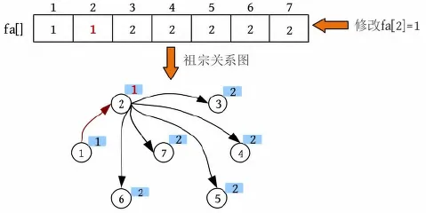

# 并查集（**Disjoint-set**）

**并查集（Union-Find Set）** 是一种树形的数据结构，主要用于处理 **动态连通性问题**，即判断一组元素是否属于同一个集合。并查集支持两种核心操作：

1. **合并 (Union)**：将两个集合合并为一个。
2. **查找 (Find)**：找到某个元素所属集合的代表（根节点）。

---

### **并查集的特点**

- **快速性**：通过路径压缩和按秩合并的优化，并查集的操作效率非常高，接近于常数时间。
- **常见应用**：
  1. **连通性检测**：判断两个节点是否连通。
  2. **最小生成树**：如 Kruskal 算法。
  3. **图的连通分量计数**。

---

### **并查集的核心操作**

1. **查找 (Find)**:
   - 找到元素所在集合的根节点。
   - 优化：路径压缩（Path Compression）将沿途节点直接指向根节点，减少查找时间。

2. **合并 (Union)**:
   - 将两个集合合并为一个。
   - 优化：按秩合并（Union by Rank）总是将高度较小的树合并到高度较大的树中，减少树的高度。

---

### **并查集的实现**

#### **基本实现**

```javascript
class UnionFind {
  constructor(size) {
    this.parent = Array.from({ length: size }, (_, i) => i); // 初始化每个元素的父节点是自己
    this.rank = Array(size).fill(1); // 初始化每个集合的秩为1
  }

  // 查找操作（路径压缩优化）
  find(x) {
    if (this.parent[x] !== x) {
      this.parent[x] = this.find(this.parent[x]); // 递归压缩路径
    }
    return this.parent[x];
  }

  // 合并操作（按秩合并优化）
  union(x, y) {
    const rootX = this.find(x);
    const rootY = this.find(y);

    if (rootX !== rootY) {
      if (this.rank[rootX] > this.rank[rootY]) {
        this.parent[rootY] = rootX; // 将 rootY 合并到 rootX
      } else if (this.rank[rootX] < this.rank[rootY]) {
        this.parent[rootX] = rootY; // 将 rootX 合并到 rootY
      } else {
        this.parent[rootY] = rootX; // 秩相同，将 rootY 合并到 rootX，并增加 rootX 的秩
        this.rank[rootX] += 1;
      }
    }
  }

  // 判断两个元素是否属于同一个集合
  connected(x, y) {
    return this.find(x) === this.find(y);
  }
}

// 示例
const uf = new UnionFind(10);
uf.union(1, 2);
uf.union(2, 3);
console.log(uf.connected(1, 3)); // 输出: true
console.log(uf.connected(1, 4)); // 输出: false
```

---

### **并查集的优化**

1. **路径压缩（Path Compression）**：
   - 在执行 `find` 操作时，直接将当前节点指向其根节点。
   - **效果**：大幅减少树的高度，从而加快后续操作。
   - 伪代码：

     ```js
     find(x):
         if parent[x] != x:
             parent[x] = find(parent[x])  # 递归查找并压缩路径
         return parent[x]
     ```

2. **按秩合并（Union by Rank）**：
   - 合并两个集合时，总是将秩（树的高度）较小的集合合并到秩较大的集合上。
   - **效果**：防止树的高度增长，从而优化操作效率。
   - 伪代码：

     ```js
     union(x, y):
         rootX = find(x)
         rootY = find(y)
         if rootX != rootY:
             if rank[rootX] > rank[rootY]:
                 parent[rootY] = rootX
             else if rank[rootX] < rank[rootY]:
                 parent[rootX] = rootY
             else:
                 parent[rootY] = rootX
                 rank[rootX] += 1
     ```

---

### **并查集的应用场景**

1. **连通性问题**：
   - 判断两个节点是否属于同一个连通分量。
   - 示例：朋友圈问题（LeetCode 547 - 省份数量）。

2. **最小生成树**：
   - 使用 Kruskal 算法构建最小生成树，通过并查集判断边是否形成环。

3. **冗余连接检测**：
   - 检测添加一条边后图中是否形成环。

4. **岛屿问题**：
   - 解决二维网格中岛屿的连通性问题。

---

### **示例问题：判断图的连通性**

#### **问题描述**

给定一个图（节点编号从 0 到 n-1），判断该图是否是一个连通图。

#### **解决方案**

1. 初始化一个并查集，大小为 `n`。
2. 遍历图中的边，使用 `union` 将两个节点合并。
3. 最后检查是否只有一个连通分量。

#### **代码实现**

```javascript
function isConnected(n, edges) {
  const uf = new UnionFind(n);

  // 将图中的边合并
  for (const [u, v] of edges) {
    uf.union(u, v);
  }

  // 检查是否只有一个连通分量
  const rootSet = new Set();
  for (let i = 0; i < n; i++) {
    rootSet.add(uf.find(i));
  }

  return rootSet.size === 1; // 只有一个连通分量表示图是连通的
}

// 示例
const n = 5;
const edges = [[0, 1], [1, 2], [3, 4]];
console.log(isConnected(n, edges)); // 输出: false
```

---

### **时间与空间复杂度**

1. **时间复杂度**：
   - 单次查找操作 `find` 的时间复杂度为 **O(α(n))**，其中 α 为反阿克曼函数，在实际应用中 α(n) 非常小，可以视为常数。
   - 合并操作 `union` 的复杂度同样为 **O(α(n))**。
   - 总体复杂度接近 **O(1)**。

2. **空间复杂度**：
   - 使用两个数组 `parent` 和 `rank`，空间复杂度为 **O(n)**。

## 图解案例

一个部落里可能有很多个家族，如何判断随机的两个人是否是亲戚关系？已知满足亲戚关系有两个条件：① A和B是亲戚，A和C是亲戚，那么B和C也是亲戚；② A和B是亲戚，A的所有亲戚都是B的亲戚，B的所有亲戚都是A的亲戚。

这种分类的典型问题可以通过**并查集**来求解。

假设现在有7个人，首先输入亲戚关系图，然后判断两个人是否有亲戚关系。

（1）初始化


（2）查找。输入亲戚关系2、7，查找到2的集合号为2，7的集合号为7。

（3）合并。两个元素的集合号不同，将两个元素合并为一个集合。在此约定将小的集合号赋值给大的集合号， 因此修改fa[7]=2。



（4）查找。输入亲戚关系4、5，查找到4的集合号为4，5的集合号为5。

（5）合并。两个元素的集合号不同，将两个元素合并为一个集合，修改fa[5]=4。



（6）查找。输入亲戚关系3、7，查找到3的集合号为3，7的集合号为2。

（7）合并。两个元素的集合号不同，将两个元素合并为一个集合，修改fa[3]=2。



（8）查找。输入亲戚关系4、7，查找到4的集合号为4，7的集合号为2。

（9）合并。两个元素的集合号不同，将两个元素合并为一个集合，修改fa[4]=2。



（10）查找。输入亲戚关系3、4，查找到3的集合号为2，4的集合号为2。

（11）合并。两个元素的集合号相同，无须合并。

（12）查找。输入亲戚关系5、7，查找到7的集合号为2，查找到5的集合号不等于5，所以找5的祖宗。首先找到其父节点4，4的父节点为2，2的集合号等于2（祖宗），搜索停止。返回时，将祖宗到当前节点路径上所有节点的集合号都统一为祖宗的集合号。更新5的集合号为祖宗的集合号2。



（13）合并。两个元素的集合号相同，无须合并。

（14）查找。输入亲戚关系5、6，查找到5的集合号为2，6的集合号为6。

（15）合并。两个元素的集合号不同，将两个元素合并为一个集合，修改fa[6]=2。



（16）查找。输入亲戚关系2、3，查找到2的集合号为2，3的集合号为2。

（17）合并。两个元素的集合号相同，无须合并。

（18）查找。输入亲戚关系1、2，查找到1的集合号为1，2的集合号为2。两个元素的集合号不同，将两个元素合并为一个集合，修改fa[2]=1。



假设到此为止，亲戚关系图已经输入完毕。可以看到3、4、5、6、7这些节点的集合号并没有被修改为1，这样做真的可以吗？现在，若判断5和2是不是亲戚关系，则过程如下。

（1）查找到5的集合号为2，5的集合号不等于5，找其祖宗。首先查找到5的父节点2，2的父节点1，1的集合号为1（祖宗），搜索停止。将祖宗1到5这条路径上所有节点的集合号都更新为1。

（2）查找到2的集合号为1，找其祖宗。2的祖宗为1，1的集合号为1（祖宗），搜索停止。将祖宗1到2这条路径上所有节点的集合号都更新为1。

（3）5和2的集合号都为1，因此5和2是亲戚关系

## 算法步骤

### 1. 初始化

每个节点所属集合为自身

```jsx
// 初始化节点集合数组
this.list = Array(n);
// 把每个元素的集合初始化为其自身
for(let i = 0;i<n;i++){
  this.list[i] = i
}
```

### 2. 查找

查找元素所在的集合

```jsx
// 获取元素所在集合根节点
find(x){
  // 如果当前元素为根节点，返回
  if(this.list[x]===x) return x;
  // 否则递归获取根节点并返回
  return this.find(this.list[x])
}
```

### 3. 合并

将两个元素的集合合并

```jsx
// 集合合并
merge(a,b){
  // 获取元素所在集合根节点
  const rootA = this.find(a),rootB = this.find(b);
  // 如果两元素在同一个集合，取消合并
  if(rootA===rootB) return;
  // 将b所在集合合并到a所在集合
  this.list[rootB] = rootA;
}
```

### **总结**

1. **并查集的作用**：
   - 并查集是一种高效解决动态连通性问题的数据结构。
   - 主要用于判断元素是否属于同一集合，以及合并集合。

2. **并查集的优化**：
   - 路径压缩：优化 `find` 操作，加速查找。
   - 按秩合并：优化 `union` 操作，减少树的高度。

3. **典型应用**：
   - 图的连通性问题、最小生成树（Kruskal）、冗余连接、岛屿问题等。

熟练掌握并查集的原理与实现，可以帮助高效解决许多图相关的问题。
