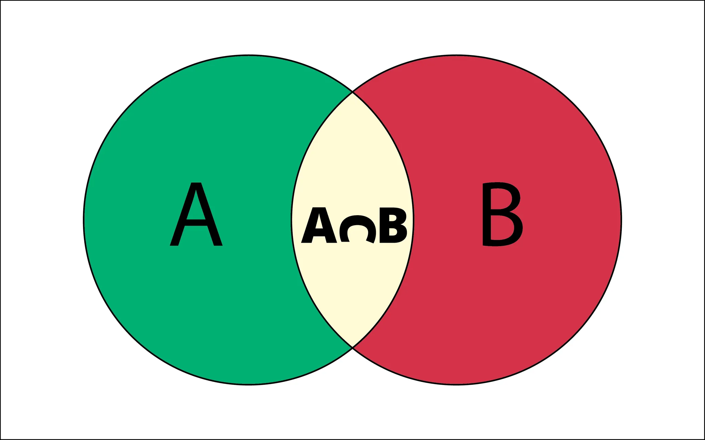
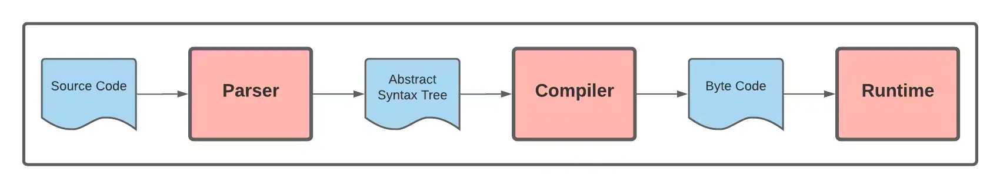
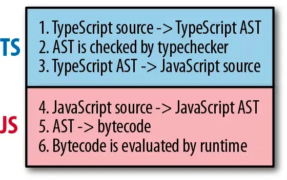

# TS的前置知识

在正式讲TS之前，我想用一个章节来讲TS的前置知识。

## TS的介绍

先看维基百科的介绍：

::: info
**TypeScript** is a [free and open-source](https://en.wikipedia.org/wiki/Free_and_open-source) [high-level](https://en.wikipedia.org/wiki/High-level_programming_language) [programming language](https://en.wikipedia.org/wiki/Programming_language) developed by [Microsoft](https://en.wikipedia.org/wiki/Microsoft) that adds [static typing](https://en.wikipedia.org/wiki/Static_typing) with optional type [annotations](https://en.wikipedia.org/wiki/Annotation) to [JavaScript](https://en.wikipedia.org/wiki/JavaScript). It is designed for the development of large applications and [transpiles](https://en.wikipedia.org/wiki/Source-to-source_compiler) to JavaScript.[[5]](https://en.wikipedia.org/wiki/TypeScript#cite_note-5) Because TypeScript is a [superset](https://en.wikipedia.org/wiki/Superset) of JavaScript, all JavaScript programs are [syntactically](https://en.wikipedia.org/wiki/Syntax_(programming_languages)) valid TypeScript, but they can fail to [type-check](https://en.wikipedia.org/wiki/Type_system#Type_checking) for [safety](https://en.wikipedia.org/wiki/Type_safety) reasons.
:::

国内社区普遍达成共识的介绍：

::: info

[TypeScript](https://link.juejin.cn/?target=https%3A%2F%2Fwww.typescriptlang.org%2F) 是一种由微软开发的自由和开源的编程语言。它是 JavaScript 的一个超集，在JS的基础上添加了可选的静态类型，能够在编译阶段检测出语法错误的编程语言。
:::

无论是国内外，社区对TS的理解总是离不开类型检查、JS的超集、静态类型等概念。很多初学者会对这些定义一览而过，直奔文章后面的TS特性讲解。而我觉得理解TS的定义是学习TS的关键所在。

## 类型系统简介

很显然，根据TS的定义，TS能给JS做类型检查，而且是静态的类型检查。这是什么意思呢？要了解这个需要先知道这背后的“类型系统”这一基础理论。

### **类型**

我们都知道计算机是0101的世界，编程语言中的程序逻辑和数据在内存空间里都是不同01的序列，在这个维度上，二者没有区别。所以当计算机误把数据当成逻辑，或者逻辑当成数据，就很容易发生错误，导致系统崩溃。举个例子来讲，JS中的eval函数，可以传一个字符串作为参数，当字符串是一串可以运行的代码，eval可以正常运行，但是如果是普通字符串，程序就会发生错误。但是这两个字符串到底是可执行的代码，还是普通字符串，对于计算机来说是无法区分的。

```tsx
eval('console.log(\'Test Me\')') // "Test Me"

eval('Test Me') // Uncaught SyntaxError: Unexpected identifier 'Me'
```

这也就为什么编程语言需要类型的一个原因，因为类型给了0101数据含义，以及一组逻辑规则。这些规则确保程序表达式使用了合理的类型数据。正如上述举的eval的例子，我们需要一套类型规则来判断其参数是否赋值合理，以便及时暴露出代码问题。

### **类型系统**

给类型下完定义后，[类型系统](https://en.wikipedia.org/wiki/Type_system)的理论不断完善和发展。大部分的编程语言都有自己的类型系统，JS有自己的类型系统，TS也有一套类型系统，Java，c#, Python等都有一套类型系统。

类型系统可以理解为编程语言里用来定义变量、函数、表达式和模块等属于何种类型的一套规则，对于变量、函数等这些源代码元素，一旦被赋值了某种类型，这意味只有这么一类的数据的全部值来可以赋值给这个变量。例如JS中的number类型，定义了变量只能赋值一个[双精度64位的浮点数](https://en.wikipedia.org/wiki/Double-precision_floating-point_format)，或者Java的int类型，定义了变量的值只能是一个32位的整数，最小值为$-2^{32}$，最大值为$2^{32}-1$。

值得一提的是刚才我们解释类型系统用了“只有这么一类的数据的全部值来可以赋值给这个变量”这个描述，是不是会让你想起高中数学里的集合概念，一个教室的全体学生是一个集合，北京、上海等这些城市是一个集合，全部的自然数01234等也属于一个集合，而且这个集合是无限的。

集合是因为我们想要把所有具有共性的元素聚集在一起而创造的概念。光造出集合的概念可不够，我们还有子集、真子集、有限集、无限集、空集、非空集、超集等等。等等，”超集“？是不是想起什么来了，回到TS的定义，它是 JavaScript 的一个”超集“，此”超集“是彼”超集“吗？

答案是肯定的，后面的章节我会给大家解释TS背后的集合论，以及利用这个集合思想可以让我们有多么容易理解TS的各种特性。



### **类型检查**

编程语言都有一套类型体系，而且各有差异。现存的编程语言数不胜数，为了方便我们学习，聪明的计算机先驱们又充分发挥了自己十分擅长的分类、归纳、定义、总结等手段给我们带来了”类型检查“这一概念和背后的理论。

我们用高中学习的集合论来理解什么是类型检查。在我印象中，无论是小学、中学还是大学，班里总是有几个体型比较胖的同学，思考这么一个找胖同学的场景：一个固定的班级里，我们想找出一个没有胖同学的集合，班里的同学体型不一，这个集合里很容易混入胖同学，那么我们怎么把这个胖同学找出来呢？类型检查就可以。那么怎么检查呢？我们想到的第一个方法就是让班里同学都把自己体重报出来，我心里有个评判标准，我觉得超过80kg就是个大胖子，所以只要我听到有同学体重超过80kg，说明他不属于这个集合，我们可以用这个方法把最终的不含胖子的集合确定下来。我们管这个方法叫做静态检查。我们还想到可以让这群学生都去操场上跑，胖同学一般体力耐力不够，跑的过程中会很快坚持不下来，我们管这个检查方法叫动态检查。

虽然上述例子不严谨，而且含有对体型大的朋友们的刻板影响，但是一切都是为了让我们更好理解计算机里的类型检查机制。不管怎么说，感谢例子中的胖子们。

所以总结起来，类型检查就是编程语言中，按照类型体系给出的一组规则践行的判断方法，把异常的类型暴露出来。

**静态类型和动态类型**

对于类型定义，经常会看到或者听到强类型、弱类型、静态类型和动态类型等词汇。这些词汇其实是为了区分不同的类型系统而衍生的概念。不同的类型系统有不同的类型检查机制，从类型检查的时机来看，类型系统可以分为静态类型系统和动态类型系统，前者是在源代码编译的时候进行类型检查，后者是在运行时进行检查。可见，我们上述的找胖子案例还是有合理之处的。

图？展示了一般的解释型编程语言从源代码解析成抽象语法树，然后编译成字节码，最后在运行时环境上运行的过程。如果一门编程语言的类型系统是在编译的时候做类型检查，那么就是静态类型系统；如果是在运行时进行类型检查就是动态系统。JS是动态类型语言，意味着它的类型体系只在运行时做检查的，在编译的时候则不做校验，所以JS允许我们为已经赋值的变量再次分配为任何其他类型的值。TS是静态类型语言，也就是说每次编译的时候都会暴露出类型错误。



既然说到TS，作为本文重点研究的对象，此处我们再延伸讲一下TS的原理，与图？不同的是，TS被解析成抽象语法树后，会被ts的编译器转为成JS代码，如图？所示。之后JS的解析和编译又回到了图？。



### **强类型和弱类型**

从类型检查的严格程度角度看，类型系统分为强类型系统和弱类型系统。对于弱类型系统，其内部会隐式地进行一定的类型转化，比如JS中的`==`运算符，当等式两边分别是1和`’1’`时，JS内部会做转化让结果为`true`。

但是值得注意的是，目前并没有对强类型和弱类型的严格定义，因为一个类型系统是静态还是动态的，这种根据类型检查的时机分类是很明显的，根据时间的单向线性或者维度的正交性，静态和动态没有重合的可能。虽然也有一些编程语言结合了静态类型检查和动态类型检查，但这并没有让我们对静态类型和动态类型分类持有怀疑态度。

但是类型强弱却一直饱受争议。因为强弱是对相同事物（在此场景下为强度）的不同程度区分，不同程度是一个非常模糊的概念，如果一个编程语言是49%弱类型检查特性，那我们就把它称为弱类型语言吗？继续用我们的找胖子案例来讲，我的评价标准是认为超过80kg是胖子，因为这个标准是我自己定的，和别人的标准可能不统一，别人可能认为超过100kg才是胖子，那我们用不同的标准试图下一个非0即1的结论，是不是很容易意见不一致。

保持严谨的态度是我们技术人该有的品质，但是日常口语中，人们还是习惯性地叫我这种类型检查方式叫做弱胖子检查，管100kg标准的叫强胖子检查。

因为类型系统强度在一个范围内，所以评价一个编程语言是强类型还是弱类型很容易产生歧义，因此便有了一个更严谨地描述：类型安全，描述了一个类型系统能够防止类型错误的性质。具有类型安全的编程语言不会产生类型错误。

## **类型怎么用**

前面我们花了很多篇幅让大家理解类型系统中的基础概念。我们知道在类型系统的底层理论中，很重要的一部分是是给出类型的规则，实现类型规则的检验机制算法，这些只是在理论和算法层面对类型系统的完善。聪明的计算机科学家们把类型体系的理论和算法整出来了，实干的工程师们按照这些理论把具体的类型系统做出来了。现在我们不禁想问一个问题：怎么用？
