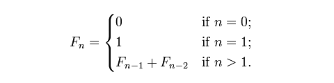

# TS实现斐波那契序列算法

## 引言

TypeScript 的类型系统已经从基本的类型注释，发展成为一种大型且复杂的编程语言。在上篇文章中，我们打开了类型编程的潘多拉魔盒，我们知道TS的强大之处，不仅在于其类型检查系统，还在于其具有图灵完备特性，可以实现强大的类型级编程能力。

在学习一般的编程语言的时候，我们首先会学习变量声明和数据结构，其次是基本的代数运算、条件分支和循环，更高阶地，我们会接触到递归，通过递归，我们可以了解到排序、动态规划等各种算法。掌握这些特性可以让我们快速入门一门编程语言，并且编写出更复杂的应用。

TS类型编程也有类似的特性，本文继续延续类型编程这个话题，从类型编程角度，重点探讨TS中的递归，我们特别以实现计算斐波那契序列为例，展现出不同的实现算法，来感受TS类型编程的魅力。

应该指出的是，本文话题仅仅是一次有意思的学术探索，内容深度已经远远超出了我们日常对TS的普通使用，给出的代码不建议在生产环境中使用。

## 类型编程的思维

TS编程语言可以看成两部分组成：

- 普通编程：在运行时体现，使用值和函数
- 类型编程：在编译时体型，使用类型和泛型

对于普通编程，我们经常涉及到的元素是

- 数据结构
- 函数
- 控制流
- 循环
- 基本代数运算（加减乘除等）

有了这些特性，大部分的编程语言都是图灵完备的，可以实现任何算法的编写，实现各种各样的复杂运算。TS的类型编程也是图灵完备的，这说明这些概念同样在类型编程的世界里也有体现。

- 数据结构 → 对象和元祖

```tsx
// 数组 -> 元组类型
const arr = [1,2,3]
// 获取下标为1的元素，arr[1]
const v = arr[1] // 2

type Arr = [1,2,3]
// 通过下标索引类型获取某个类型元素，Arr[1]
type t = arr[1] // 2

// 对象 -> 对象类型
const obj = {
  name: "John",
  age: 23,
};
const name = obj.name; // 'John'

interface Obj {
  name: string;
  age: number;
}

type Name = Obj["name"]; // string
```

- 函数 → 泛型类型

```tsx
const f = (num) => num;
const v1 = f(1)(); // 1
const v2 = f("str")(); // 'str'

type F<T> = T;
type T1 = F<number>; // number
type T2 = F<string>; // string
```

- 控制流 → 条件类型`extends`

```tsx
const ans = 2 === 1 ? true : false;
// 如果2等于1，进入true分支，否则进入false分支

type Ans = 2 extends 1 ? true : false;
// 如果2（字面量类型）是1类型的子集，进入true分支，否则进入false分支
```

- 循环 → 函数式编程的递归

```tsx
const reverse = (arr) => {
  const n = arr.length;
  for (let i = 0; i < n / 2; i++) {
    [arr[i], arr[n - i - 1]] = [arr[n - i - 1], arr[i]];
  }
  return arr;
};
const arr = [1, 2, 3, 4, 5];
const res = reverse(arr); // [5,4,3,2,1]

type Reverse<
  T extends number[],
  N = T["length"],
  U extends number[] = []
> = U["length"] extends N ? U : Reverse<T, N, [T[U["length"]], ...U]>;

type Target = [1, 2, 3, 4, 5];
type Res1 = Reverse<Target>; // [5,4,3,2,1]
```

- 基本代数运算（加减乘除等） → 通过访问元祖长度实现加减乘除

```tsx
// 类型编程的加减乘除运算
type BuildArr<
  Num extends number,
  Arr extends unknown[] = []
> = Arr["length"] extends Num ? Arr : BuildArr<Num, [1, ...Arr]>;

// 减法
type Sub<T1 extends number, T2 extends number> = BuildArr<T1> extends [
  ...arr1: BuildArr<T2>,
  ...arr2: infer Rest
]
  ? Rest["length"]
  : never;

// 加法
type Add<T1 extends number, T2 extends number> = [
  ...arr1: BuildArr<T1>,
  ...arr2: BuildArr<T2>
]["length"];

// 乘法
type Mul<
  T1 extends number,
  T2 extends number,
  Res extends number = 0
> = T2 extends 0
  ? Res
  : Mul<T1, Sub<T2, 1>, Add<Res, T1> extends number ? Add<Res, T1> : never>;

// 除法
type Div<
  T1 extends number,
  T2 extends number,
  Res extends number = 0
> = T1 extends 0
  ? Res
  : Div<Sub<T1, T2>, T2, Add<Res, 1> extends number ? Add<Res, 1> : never>;
```

可以看出，正是TS类型有条件分支和递归能力，才有了实现强大类型编程的基础。

## 斐波那契序列的递归实现

在学习一门新的编程语言时，我们通常以打印“Hello World”作为入门案例。同样，通过递归实现斐波那契数列，也可以看作是学习递归算法的一个“Hello World”级别的案例。

作为数学中一个重要的序列，斐波那契序列在理论和实践应用中都有重要价值。深入理解它可以帮助我们更全面地掌握数字模式和算法思路。

斐波那契序列具有这样的特点：除了前两个数字0和1之外，任意一个数字都等于前两个数字之和。数列的展开式为：0, 1, 1, 2, 3, 5, 8, 13, 21, 34, 55, 89, 144, 233, 377, 610, 987...。也就是说:



实现斐波那契序列最简单的算法就是递归，下面是用JS编写的递归算法：

```tsx
const fib = (n) => {
  if (n === 0) return 0;
  if (n === 1) return 1;
  return fib(n - 1) + fib(n - 2);
};

console.log(fib(10)); // 55
```

可以看到递归最重要的两个特性：

- base case：逃出递归的条件
- 调用自身

TS类型编程中的递归和JS的递归其实没什么太大区别，也具有这两个特性，只不过语法不一样。下面的代码是TS的纯类型编程版本：

```tsx
type Fib1<N extends number> = N extends 0
  ? 0
  : N extends 1
  ? 1
  : Fib1<Sub<N, 1>> extends infer t1 ? Add<t1 extends number ? t1 : never, Fib1<Sub<N, 2>> extends infer t2 ? t2 extends number ? t2 : never : never> : never
```

可以看到我们用两个`extends`条件类型给出了两种base case, 第三种情况是不断调用自身。在进行类型编程的时候，我们思路其实就是按照算法来编写，然后按照TS提供的特性来实现。因为TS类型编程不能修改类型的状态，而且只用"表达式"，不用"语句"，这两个特点和**函数式编程**一样，所以进行类型编程的时候，我们采用的是函数式编程思想。

- 不能修改类型状态

TS可以用`Infer`来存储一个类型，但是该类型不能被修改，保存新的类型值。普通编程语言一般都有`for`循环，这是因为他们定义的变量的状态可以改变，通过可变的状态来作为计数器实现循环，但是TS的类型编程没有`for`循环，要实现遍历则需要使用递归，通过递归函数的参数来保存或更新状态。

- 只用"表达式"，不用"语句"

TS的类型编程基本上只有一个表达式，例如`X extends Y ? A : B`，这个表达式是一个单纯的运算过程，总有返回值。从斐波那契递归算法的例子可以看到，我们写的类型编程其实也就是一个比较长的表达式，而且表达式里可能有别的表达式。

## 动态规划和矩阵快速幂运算

递归方法具有很高的时间复杂度，因为有大量的重复计算。为了减少时间复杂度，斐波那契序列的计算也有很多优化算法，例如动态规划和矩阵快速幂运算。本节也用TS类型编程来实践一下。

### 动态规划

先讲动态规划，动态规划分两种：带有备忘录的自上而下和自下而上。下面给出了JS实现代码：

```tsx
// top down
const fibMemo = (n, memo = [0, 1]) => {
  if (memo[n] !== undefined) {
    return memo[n];
  }

  memo[n] = fibMemo(n - 1, memo) + fibMemo(n - 2, memo);
  return memo[n];
};

// bottom up
const fib = (n, arr = [0, 1]) => {
  for (let i = 2; i <= n; i++) {
    arr[i] = arr[i - 1] + arr[i - 2];
  }
  return arr[n];
};
```

因为TS类型编程无法修改备忘录的状态，所以目前无法实现带有备忘录机制的纯类型编程。但是可以实现自下而上的动态规划，代码如下：

```tsx
type FibBottomUp<N extends number, Arr extends any[]=[0,1]> = 
  Arr[N] extends number
    ? Arr[N]
    : FibBottomUp<N, [ ...Arr, ...[ Add<Arr[Sub<Arr['length'], 1>], Arr[Sub<Arr['length'], 2>]> ]]>;

// 测试
type res2 = FibBottomUp<10>; // 55
```

可以看到我们通过`Arr`的长度来实现循环迭代，元组`Arr`的每个下标`index`对应着`fib(index)`结果。每次计算计算`fib(n)`的时候，都会先计算`fib(n-1)`和`fib(n-2)`的值，这种思路就是自底向上的动态规划，求解最终问题之前，会从问题的子问题开始，逐步构建到最终问题。

### 矩阵快速幂

动态规划算法由于每个节点只会计算一次，所以时间复杂度是O(n)。矩阵快速幂比动态规划的时间复杂度更低。那么矩阵快速幂是怎么推导来的呢？

我们知道，斐波那契数列有递推公式：

$$
F_{n+2}=F_{n+1}+F_n, n ∈ 0,1,2..
$$

把这个公式改写成矩阵运算，可以得到下面的式子：

$$
\begin{bmatrix}
F_{n+2}\\
F_{n+1}
\end{bmatrix}=\begin{bmatrix}
1& 1\\
1& 0
\end{bmatrix}*\begin{bmatrix}
F_{n+1}\\
F_{n}
\end{bmatrix}
$$

也就是说，当n=0, 1, 2的时候，我们又下列公式，

$$
\begin{bmatrix}
F_{2}\\
F_{1}
\end{bmatrix}=\begin{bmatrix}
1& 1\\
1& 0
\end{bmatrix}*\begin{bmatrix}
F_{1}\\
F_{0}
\end{bmatrix}
$$

$$
\begin{bmatrix}
F_{3}\\
F_{2}
\end{bmatrix}=\begin{bmatrix}
1& 1\\
1& 0
\end{bmatrix}*\begin{bmatrix}
F_{2}\\
F_{1}
\end{bmatrix}=\begin{bmatrix}
1& 1\\
1& 0
\end{bmatrix}^2*\begin{bmatrix}
F_{1}\\
F_{0}
\end{bmatrix}
$$

$$
\begin{bmatrix}
F_{4}\\
F_{3}
\end{bmatrix}=\begin{bmatrix}
1& 1\\
1& 0
\end{bmatrix}*\begin{bmatrix}
F_{3}\\
F_{2}
\end{bmatrix}=\begin{bmatrix}
1& 1\\
1& 0
\end{bmatrix}^3*\begin{bmatrix}
F_{1}\\
F_{0}
\end{bmatrix}
$$

所以对于`n`，我们有

$$
\begin{bmatrix}
F_{n}\\
F_{n-1}
\end{bmatrix}=\begin{bmatrix}
1& 1\\
1& 0
\end{bmatrix}^{n-1}*\begin{bmatrix}
F_{1}\\
F_{0}
\end{bmatrix}
$$

所以只要求解出幂次部分就可以求解`Fn`，而幂次部分求解可以使用快速幂公式，如下

$$
T^{n} = T^{n/2}*T^{n/2}, n为偶数，\\
T^{n} = T^{n/2}*T^{n/2}*T, n为奇数，
$$

这说明要求解$T^n$只需求解$T^{n/2}$即可，而求解$T^{n/2}$，只需求解$T^{n/4}$，依次递推，我们可以发现整个幂运算其实就是不断二分，时间复杂度就是二分法的时间复杂度，为`O(lgn)`.

知道了什么是矩阵快速幂，我们可以很容易得写出对应的类型代码：

```tsx
type Matrix = [number, number, number, number]; // [a, b, c, d] represents the matrix [[a, b], [c, d]]
type MatrixMultiply<A extends Matrix, B extends Matrix> = [
  Add<Mul<A[0], B[0]>, Mul<A[1], B[2]>>,
  Add<Mul<A[0], B[1]>, Mul<A[1], B[3]>>,
  Add<Mul<A[2], B[0]>, Mul<A[3], B[2]>>,
  Add<Mul<A[2], B[1]>, Mul<A[3], B[3]>>
];

type MatrixPower<M extends Matrix, N extends number> = N extends 1
  ? M
  : IsOdd<N> extends true
  ? MatrixMultiply<
      Div<Sub<N, 1>, 2> extends infer R1
        ? R1 extends number
          ? MatrixPower<M, R1>
          : never
        : never,
      Div<Sub<N, 1>, 2> extends infer R1
        ? R1 extends number
          ? MatrixPower<M, R1>
          : never
        : never
    > extends infer R2
    ? R2 extends Matrix
      ? MatrixMultiply<M, R2>
      : never
    : never
  : MatrixMultiply<
      Div<N, 2> extends infer R1
        ? R1 extends number
          ? MatrixPower<M, R1>
          : never
        : never,
      Div<N, 2> extends infer R1
        ? R1 extends number
          ? MatrixPower<M, R1>
          : never
        : never
    > extends infer R2
  ? R2 extends Matrix
    ? R2
    : never
  : never;

type FibMatrix<N extends number> = N extends 0
  ? 0
  : N extends 1
  ? 1
  : MatrixPower<[1, 1, 1, 0], N> extends infer R1
  ? R1 extends Matrix
    ? R1[1]
    : never
  : never;

// Test
type MatrixResult = FibMatrix<15>; // 610
```

## 总结

本文给出了三种斐波那契序列算法的类型编程实现方式，最终的代码可以在查看这个[playground](https://www.typescriptlang.org/play?#code/PTAEBcGdG8fRo9UNH9DQXoPO1ANzoBNNBHNoYoTCKmodO9BVmwChiRRBO00IEZAsf-AHsAHUAEwYHcA7UQK8DAoOUAwAYGg5QCFugCqVAgAaARyMBISsXABPJgFNQAMQCWAI2oAeAHKgVAD3AqurSKC4BXALbaVAJwB8oALygjp85esADMSgoAD8oEEhAFzexmYWVqDUwWFJKTFaunoAyrbahgA0Sa7uvgnWmlwAZi4Q1KkAgqyseuD1Zf42Dk7OqW2gMVwqAG4uRZn6ufkGRQBMJXF+iZU1veCzfRsdiXaOteHrAzYjtYMnbkdDo84p5ID+8oAUrqBNLRM5eYXFi+WgK7Wa5ns9XCrnGOkmHxmoHmC0AWPKAUqNAJip9GUakqkHAAEMuOBNJjcQweJprKYAMYqSCQTSjAA2ijYKhULGxrFATAYlJ0dN+1UqAJUACJjM5nAxnAA6UhKVSgZwUrxvagAVnc5AAbNQgmQwFRZrReMJBPwJDJ5NK1JkAEIMcCMewAVSYhm+nV2PSKDRFLsS2MUAG0ALoeQPuLwpT3OP0GAPe6xulwpELhCNRgOJo5Wm12x2fP2gcUFiNFAvigAUKYA5DSLABzcAACwrMe2gVAAB8kqk-ZXq1w642AzGYnmXnoU1MxyK-VXaw2m0VqK4Ax6pxOe7OB3Ml+4AwBKAOuADcUtRGh01ttDAdTFmzpbXT2zhXvXvvsDwYCBWoB88oHDU+jWMHx6dNkwAtMQmiM9tAvbMb1zfNCxFYsCxHZpJ0jNcpxnPs52XYp8PHD511wzdoW3UBByPE8ZTlSANgVc8syvR1b01I9QHIJUlVIbVKEIABmWhAEv3QBWNMAa-1AHwEwAhPQUU8AFl8WcTQTF-P14yfYCxi0zSNIDQ9OLAP1MSKbQilJIpWBjOUmDoiwoAges1HsJSVNAP1jNM-C-QsthBzkmVFPAZSTHk2waVxJg6THICgpCopLVi1yTFDdzw3QsKaTHP0Anwy0coPIpMuy78Er9WYD1BdKWmKhoCrK79QVAWq-VK0B8oEyqCmqvQWoqsrcqalrOrKiqSm6kJRz6vLWsK5rwuykb2r9TqSmIfTSHIQBYOUeQAYuUAMCVCFEMTpMAQuj8FEKhACDNYRaD481muSgAFTgXF6pLgpUoofHiV1uhcVKfqWaxknIJNmr4qDSzilSXo4N75KKCcoUXUpfuWapagAJWBEIcY+kLUhh0Lwsi6LEdAHH3DOa5LnOXdjz4sSpNkh7ibhhGCa+2J7w0wGgOScH5PSUAAElIAAeXQgw0eBiBnFsFQUnCYnMrJxQ9HTEIABFqXeaYFya+YgL+Xoca1yDwnx3n-puSD7ctx7PpMDnnF6ooqYt+2aYTB3IJ9p8Ld14Z9c+RctxNzGzcFv3Umt9G41tr3HfZ163Ypz3Y-945rmTgP01ln5Tcp2ZQJLrmTAtlXkrVzQoo1jP5gt-PvZz32jlV0m6+ioO9ahY372L82s6t9oE505OheetP3cpxdJ7p3Os4DiaHeDz4B-HoeY790egI0hfq+d13Z8zrPF-bv2W8gwvOiH0vwaxrZx+Jsun-Ta+A8ZgKLR0Ym73HnzX8QMfiRFSGAmIIDOgx3CDHGIqd4Zu1aguFBER8Iy0jqsOeys54VzftQWaH8252wvs4Rm5AAAqFJwA-ydiFLGFJSa-kyP-ZUHF1Sal4uQQAX+qABpzQAx3KAAdTQAC-H4EAKHxgBKpUANs2sA4C0InBQsecsNJFAoc-ZRttUqWlsJoGkrAIx6EUbfRIfoUglkxCKagMRtG6P0SKQx8xV7mJFLMGIQ9qHrRwQwjEfoBS9n7AKCCpDGYPVHIo-ettVHqJ+EArwpiQjOOcFY9qOi9EGKMU4gsFjnCuJSbY9JTcAzTn8XhEJCkFrhJto+KJETqmUwpLUnoHgAipTUUBAIccKTwIqdQJGHw1FfiaqObxBQjGNP2M8dCIyxlRCuADUAZSZTrxSJUwBkSVnRL+tUlI3jxm9C8EEVpSjQFeIpCLdeCjemgDUU1AZkyWgjK+FUnojQpkUkNqQ6iIQaJqBsWk+xKQDAOD2avCMQFbBcAANZcE4FwQMak0ypRTH4jcgSgJAvsI0L01jUl2LdhiooyDELigjAeRZahxZSxaFAnYmjgECz6ArNQMRKXoWRgUGE+9zipCqJiGkkBmVi0lmyyEHK1oPXFgAUVGFwABGjHz83vB0g4TKjhSplaHGYnLebcvCLy-lgr1UWE1WK1wxAgA)。

虽然TS的类型编程很强大，但是在编写的时候，我不得不指出一些体感不好的地方，比如很难debug，使用递归会经常遇到`”type instantiation is excessively deep and possibly infinite" error.“`报错，这个时候就得通过`infer`来定义一个局部类型，再给这个类型加一个条件判断来解决，这会让代码更加复杂难懂。除此之外，我觉得类型编程的性能不高，而且难以衡量，比如当你想计算更大的`n`的时候，上述给出的三种方法可能会算不出来，返回一个`any`类型。如果想要看结果，只能通过把鼠标hover到这个类型上查看，没有一个console.log之类的方法打印出来。
