# Think in {Set}，从集合论的角度理解TypeScript

> In TypeScript, it’s better to think of a type as a *set of values* that share something in common. Because types are just sets, a particular value can belong to *many* sets at the same time.  —— [TypeScript官方文档](https://www.typescriptlang.org/docs/handbook/typescript-in-5-minutes-oop.html#types-as-sets)
>

## 引言

我们都知道，计算机是用二进制来保存所有数据的，计算机的本质是对二进制数据进行各种逻辑运算，但是对于我们人类来讲，使用0101这样的语言直接和计算机沟通十分困难，所以在此基础上，我们逐渐发展出了人能看懂的高级语言。

在高级语言中，我们对0101的具体数据抽象出了变量、类型与值等概念。值是计算机直接进行逻辑运算的实际数据，变量是一个存储值的容器，类型则定义了一个变量可以保存、或者一个值所属的数据类型。不同的数据类型具有不同的运算和操作，如JS的number类型可以进行加减乘除四则运算，object类型可以进行索引访问每一个元素。对object类型的数据进行加减乘除肯定会报错，对number类型的数据进行下标索引肯定也会报错。所以，对于编程语言来讲，都需要一套类型系统，可以在编译的时候实现类型检查，及时对类型不匹配的问题进行报错，或者在运行的时候进行隐式转换，防止程序发生错误。

JavaScript (JS)是一种弱类型、动态的语言，其内部规定了八种数据类型： `number`、`boolean`、`string`、`object`、`bigint`、`symbol`、`undefined`、`null`。变量在定义的时候不会直接和某一特定的类型联系，可以保存任何类型的数据，具体的类型会在运行时计算出来。

TypeScript (TS)是JS的超集，而且是在编译时做类型检查的静态类型系统。为了兼容JS的所有语法、运行时类型检查以及实现自己独有的静态类型检查，TS的类型系统除了包含了JS的所有类型，还多加了一些类型，如元组（Tuple）、接口（Interface）、枚举（Enum），而且还支持泛型，提供了各种类型运算，可以实现强大的类型编程。

TS的类型系统比JS复杂得多，如何理解TS的各种类型和类型运算，是我们熟练使用TS的前提。本文将数学上的集合观点代入到TS的类型体系中，帮助大家更好地使用TS进行编程。

## 高中数学里的集合

集合是[集合论](http://www.tup.com.cn/upload/books/yz/075970-01.pdf)中最基本的概念。在高中数学里，我们学会了集合的概念。我们可以把方程$x^2-1=0$的实数解看成一个集合，全部的自然数看成一个集合，某高校的全体学生看成一个集合，平面上所有点看成一个集合。

对于集合的表示，通常有三种。

第一种是使用`{}`以及`,`把一个集合的所有元素列举出来描述，例如`A={1,2,3,4}`，`B={a,b,c,d}`，`C={true, false}`。

如果`{}`中的元素有无限个，无法列举，或者具有某种规律，则可以用第二种方法来描述，也就是将里面的元素用一些变量或者符号来描述，$\{x \in S | p(x)\}$，表示使`p(x)`为真的所有`x`的集合，且`x`满足属于`S`集合中。

第三种集合的表示则是画图法，如下图所示，用一个圈表示一个集合，集合内部有一些元素，集合和集合具有一定关系。

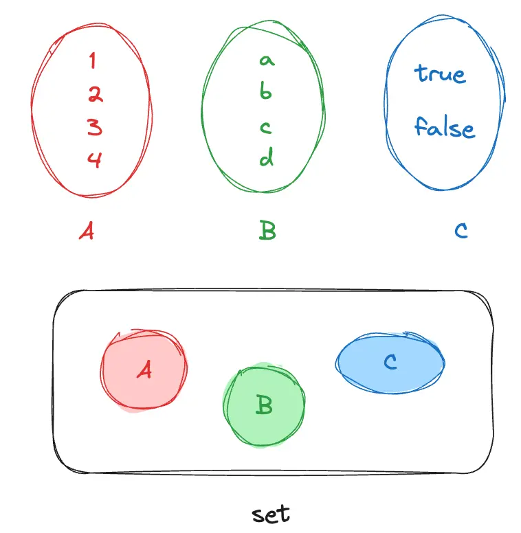

对于一些常见的集合，在数学上，规定了一些字符来描述。例如全体实数集合`R`，全体自然数集合`N`，有理数集合`Q`，不包含任何元素的空集$\emptyset$。

在了解完集合的概念后，我们开始学习集合间的关系。如子集，表示集合之间的包含关系，如果A是B的子集，即$A \subset B$，表示A集合中的所有元素都属于B集合。与子集相对立的是超集，如果A是B的子集，那么B则为A的超集。

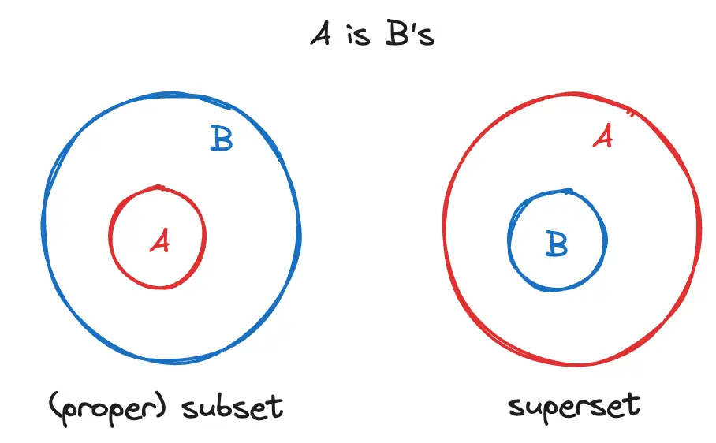

除此之外，两个集合之间的关系可能还存在相等、有交集、没有交集的情况，为了更好的描述，我们又多出了“交集”、“并集“和”补集“的概念。

交集：$c \in A, c \in B$，那么所有c元素组成的集合是A和B集合的交集，记作$C = A \cap B$；

并集：A和B两个集合的所有元素合并在一起组成的新集合C，记作$C = A \cup B$；

补集：在一个大集合中，所有属于C集合而不属于A集合的元素，记作$C=\bar A$或者C = A‘。

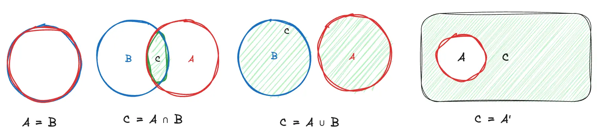

集合运算同其他代数运算一样, 都遵循一定的运算律. 下面列出了一些常用的主要运算律：

- 幂等律： $A \cup A = A,A \cap A = A$
- 交换律：$A \cap B = B \cap A,A \cup B = B \cup A$
- 结合律：$(A \cup B) \cup C = A \cup (B \cup C),(A \cap B) \cap C = A \cap (B \cap C)$
- 分配律：$A \cup (B \cap C) = (A \cup B) \cap (A \cup C),A \cap (B \cup C) = (A \cap B) \cup (A \cap C)$

## TS概念映射到集合中

回顾了高中学习的集合知识，现在我们来把它用到TS类型中。

### 理解类型与值

在集合论中，我们把类型看成是一个具有若干值的集合，这些值就是集合里的元素，集合与集合之间具有一定关系，可以帮助我们理解TS类型与类型之间的关系。

在TS中，类型与值的关系，就好比是数学里的集合与元素的关系。例如`number`类型，可以看成这个集合里包含了TS中所有的数字值；`string`类型可以看成一个包含了所有可能字符串值的集合；`boolean`集合只有两个元素：`true`和`false`，`undefined`和`null`类型分别只有一个元素：`undefined`和`null`。`Object`类型包含了所有的（类）对象数据结构，如函数，日期，正则，对象等。

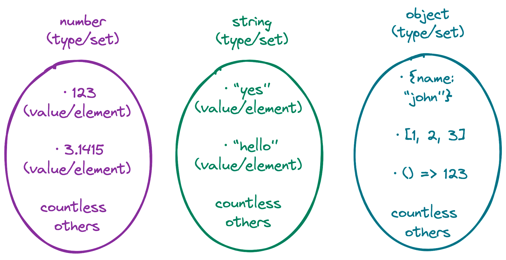


和大部分的编程语言一样，TS也有一个常见的赋值表达式：在这串代码中，`name`和`age`是一个变量，分别定义了`string` 和`number`类型，被赋值了一个相同值”`Alice`”。

```tsx
const name: string = "Alice"; // 合法

const age: number =  "Alice"; // 不合法：Type 'string' is not assignable to type 'number'
```

我们用集合的观点来解读上面这片代码的类型定义，是这样的：

- `Alice`这个元素（值）属于`string`集合（类型），所以把它赋值给被`string`类型约束的`name`变量，是合法的，可以通过TS的类型检验；
- 但是`Alice`这个元素不在`number`集合中，所以把它赋值给被`number`类型约束的`age`变量，TS会报错

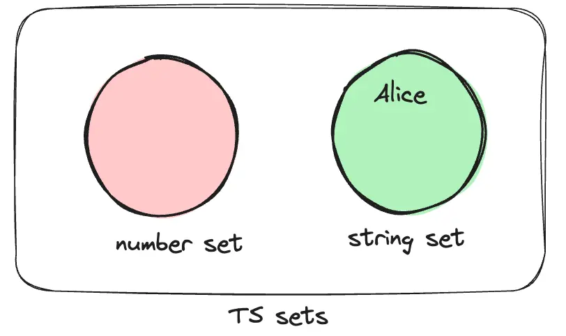

在TS中，一个值直接赋值给一个变量，我们可以通过元素与集合之间的关系来很容易来解读。那么如果是一个变量赋值给另一个变量呢，这种解释还能成立吗？我们看看下面这片代码：

```tsx
const num = 1
const num1:number = num;

const num2:{} = num1;
const num3:number = num2; // error: Type '{}' is not assignable to type 'number'.

```

在第4行代码中，`num2`的值是1，但是赋值给被`number`类型约束的`num3`变量却报错。错误的原因是`num2`的值虽然是1，但是其类型是`{}`，类型`{}`的值无法赋值给`number`类型的变量。这说明用元素和集合的关系来判断TS类型的赋值问题非常局限，我们需要新的解释模型。

让我们来试试用集合之间关系来解释上述代码。`num`类型是1，是TS的[字面量类型](https://www.typescriptlang.org/docs/handbook/literal-types.html)，可以赋值给`number`类型的`num1`，说明字面量类型1是`number`类型的子集，所以TS允许赋值；`num2`类型是`{}`，是一个没有属性的`interface`类型，不能赋值给`number`类型，但是可以被`number`类型赋值，说明`number`类型是`{}`的真子集，如下图所示。

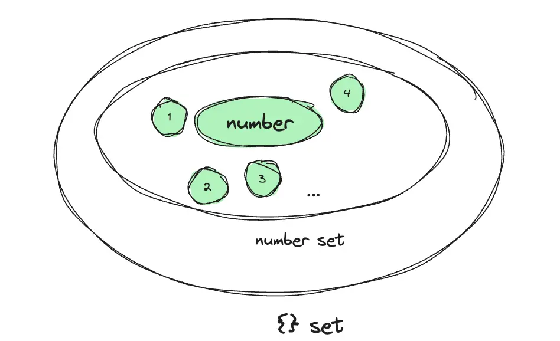

所以，TS中的类型赋值问题，可以看成是不同类型之间的集合关系。A是B的子集，所以A类型可以赋值给B类型。

对于TS中的`string`, `number`, and `boolean`等基础类型，其子集不仅包含这个类型本身，还有这个类型包含的所有值元素表示的字面量类型。

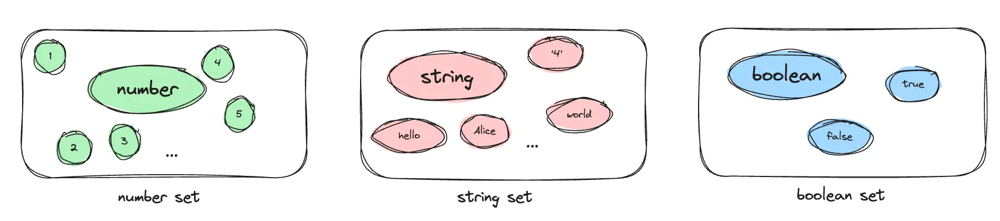

### **理解`never`和`unknown`**

TS提供了`any`, `never`, `unknow`, `void`类型，这四个类型JS都没有，但是肯定有它存在的道理。

TS的`never`表示的是永不存在的值的类型，什么情况下会有不可能存在的值呢？如果一个值既是0又是1，这个值肯定不存在，那么这个值就是`never`类型。

```tsx
type a = A & never; // never 
type b =  A | never; // A 
type c = Exclude<0, 0>; // never
type d =  0 & 1; // never
```

联想到集合，`never`类型其实就是空集，表示一个不存在任何元素的集合，而且空集是任何集合的子集，所以`never`类型可以赋值给任何类型，但是任何类型都不能赋值给`never`类型。

下表给出了[TS官方文档](https://www.typescriptlang.org/docs/handbook/type-compatibility.html#any-unknown-object-void-undefined-null-and-never-assignability)中给出的常见类型的赋值特性（assignability）。

|  | any | unknown | object | void | undefined | null | never |
| --- | --- | --- | --- | --- | --- | --- | --- |
| any  |  | **✓** | **✓** | **✓** | **✓** | **✓** | ✕ |
| unknown  | **✓** |  | ✕ | ✕ | ✕ | ✕ | ✕ |
| object  | **✓** | **✓** |  | ✕ | ✕ | ✕ | ✕ |
| void  | **✓** | **✓** | ✕ |  | ✕ | ✕ | ✕ |
| undefined  | **✓** | **✓** | ✓ | **✓** |  | ✓ | ✕ |
| null  | **✓** | **✓** | ✓ | ✓ | ✓ |  | ✕ |
| never  | **✓** | **✓** | **✓** | **✓** | **✓** | **✓** |  |

从上面这张表中，我们还可以看出`unknown`类型可以被所有类型赋值，但是除了`any`外，不能被任何类型赋值，所以`unknown`类型是一个全集，与数学上的所有自然数集合`N`类似。此处引用一下[**1.2W字 | 了不起的 TypeScript 入门教程**](https://juejin.cn/post/6844904182843965453?searchId=202308011624346198C61171204F01C9B0#heading-10)的代码用例：

```tsx
let value: unknown;

value = true; // OK
value = 42; // OK
value = "Hello World"; // OK
value = []; // OK
value = {}; // OK
value = Math.random; // OK
value = null; // OK
value = undefined; // OK
value = new TypeError(); // OK
value = Symbol("type"); // OK
```

### **理解`any`**

看到这里大家可能觉得很奇怪，对着上面这张表，我们可以看到所有类型都可以赋值给`any`类型，为什么`any`类型不是全集呢？

因为从集合论来看，全集类型只能是`unknown`类型，`any`类型可以赋值给任何类型，已经不符合全集的概念。`any`类型可以看成是`never`和`unknow`类型的混合类型，既有`never`类型的特性，可以赋值给任何类型；又有`unknown`类型的特性，任何类型都可以赋值给它。

所以严格来说`any`不能看成是集合。那TS为什么设计`any`类型呢？一个很重要的原因，我觉得和TS的定位有关，TS是JS的超集，TS必然需要提供一种能力可以回退为JS，在TS中将所有变量都定义为`any`类型，相当于是禁用TS的静态类型检查功能，让TS退化成动态弱类型的JS。

### **理解`void`**

现在我们来想想`void`类型，很多资料里说`void`表示没有任何类型，这句话讲了好像没讲一样，让我们来用集合的观点理解`void`。

```tsx
// The inferred return type is void
function noop() {
  return;
}
```

有了集合的概念后，我们有两个思考角度，第一，`void`集合里能放什么值元素？只能放`undefined`。第二，`void`集合里能放什么类型元素？有三个：`never`, `void`, `undefined`。

试试这个 👉👉 [playground](https://www.typescriptlang.org/play?ssl=22&ssc=51&pln=14&pc=1#code/FAGwpgLgBAbghiArmAXLA9gSwCYG5jxJhQC8UEATsrlAPS1QAqAngA7EDkARuuuHADsOUTAGcoA9NDijRmAOYC4XcOXTk2nGFmwcCCZKSgAWAEw16TTVA4DEAWy5gKwsRKlQZcxctUR1ENYc2jh6hIZkAEQAEmAgIOoA6ugUINiRFgws7DailJgC8q7iktKyCkoqxP4aOcE6HAB0+kRGANoAuplWdQJgMM6dxe5l3pV+AUEhui0RUADeAL7d2ZxLw6We5T5VarVaDbPEZACycBAAFo0Ugtjo9itBABQAlKQAfBIOTi4iJR5eCq+aqTOrTMIGY5feKPXqIeIbAHbcYg-Y2cFHIyIATYMAAMwKYDwdAYAHkANKYsh9ADuPTAAFEKBQUq9YZxVkyWb83JtATsJmj6qEqVAAMrMRx8J6RQLsSIvdm5SU8ECI0ZA3Y1OUHEXAYA68gARiMfQGFCgYAAHhAwDjxNMoAB+chUYhoPEIURgbqUZAG6wQUxYnH4wnYS02u3YB06Z2uwwer0+kkJsABnIQADMRkd1tt9owOHjfvdUE9IG9vrd+sNEGMIYA1pIaQJIwWY0WIy7S1Ak5WU5YK96M9UAKym+EgdvR2PFntuvvl5PdYfpusANiMJvzs67JcX-arqbXo-IAHYjEsZ4XHQvE8uB6vk0A) 👈👈

```tsx
let value: void;
value = true; // Type 'boolean' is not assignable to type 'void'
value = 42; // Type 'number' is not assignable to type 'void'
value = "Hello World"; // Type 'string' is not assignable to type 'void'.
value = []; // Type 'never[]' is not assignable to type 'void'
value = {}; // Type '{}' is not assignable to type 'void'
value = Math.random; // Type '() => number' is not assignable to type 'void'
value = null; // Type 'null' is not assignable to type 'void'
value = undefined; // OK
value = new TypeError(); // Type 'TypeError' is not assignable to type 'void'
value = Symbol("type"); // Type 'symbol' is not assignable to type 'void'

type t1 = never extends void ? true : false; // true
type t2 = undefined extends void ? true : false; // true
type t3 = void extends void ? true : false; // true

type t4 = unknown extends void ? true : false; // false
type t5 = null extends void ? true : false; // false
type t6 = 1 extends void ? true : false; // false
type t7 = {} extends void ? true : false; // false
```

知道了这两个思考点，我们很直观地看出`void`类型的本质，以及理解容易和`void`类型混淆的`undefined`类型的区别，如下图所示。

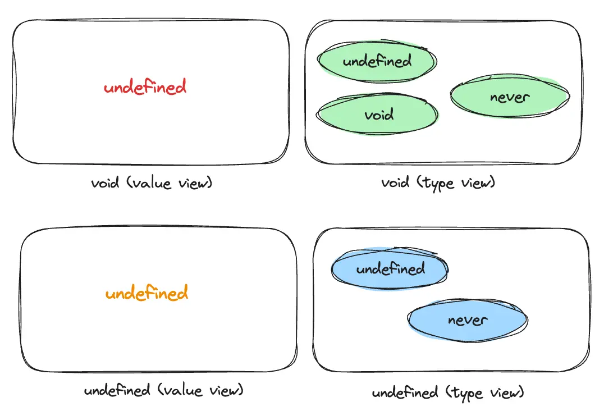

从元素上来看，`void`和`undefined`都只能设置`undefined`这个值，所以尽管在`void`的使用场景中，函数不`return`任何数，这个返回值其实还是`undefined`。

```tsx
// The inferred return type is void
function noop() {
  return;
}
console.log(noop() + 'aaa') // "undefinedaaa"
```

从集合间的关系来看，`undefined`类型不包含`void`类型，说明`void`类型有其独特的存在性，不能用`undefined`来代替。那TS为什么设置void类型？

因为TS的设定就是要成为JS的超集，要兼容JS的所有语法，只是在JS的基础上加一套更严格的静态检查机制，而`undefined`类型被TS设定为像`number`, `string`, `boolean`等基础类型一样，只能被对应的数据类型赋值。`void`类型被创造出来是为了兼容JS的一些原型方法，使其可以经过TS的类型检查，而不被认定为类型错误。比如原生的`Array.prototype.forEach`方法。

试试这个 👉👉 [playground](https://www.typescriptlang.org/play?#code/CYUwxgNghgTiAEAzArgOzAFwJYHtVJxgFEowALARgB4AVAPgApYYAueGgbQF0AaeMKBAgAjUgGs2DEBDY0AlPAC8deADccWYHLbrNAbgBQEEBngZYAcxMU2qZAFthIGNyXxuhxIRLkKDDhR8AEx8AMy88NJKKuYwVhgUAHQADsgAzmRSEHJyevAA9PnwAPIA0gYVoJCwCCjo2HgExKRkQbSMzLLcfAJComAS8FmyCsrwaKCIWKggWjoawIbGprHxQbYOTi5cbh4GXs3kQf6B8CHw4XxRY6smQSnpmdI5eYXsAJ7JCADkdo7O33gWDS8FQOFMUDSaSwFlQUGExjMODMnx+ExAUxmwG+iSAA) 👈👈

```tsx
declare function forEach1<T>(arr: T[], callback: (el: T) => void): void;
let target1: number[] = [];
forEach1([1, 2, 3], el => target1.push(el)); // OK

declare function forEach2<T>(arr: T[], callback: (el: T) => undefined): void;
let target2: number[] = [];
forEach2([1, 2, 3], el => target2.push(el)); // Type 'number' is not assignable to type 'undefined'.
```

### 理解结构式类型匹配

在TS中，定义一个有具体属性的对象类型有三种写法：

```tsx
// 接口
interface IPerson {
  name: string;
  age: number;
}

// 类型别名
type TPerson = {
  name: string;
  age: number;
};

// 对象类型
let person:{ name: string; age: number};
```

这三种写法本质都一样。如果是用一个字面量的值赋值，该值所具有的属性不能多不能少，否则TS会报错。

```tsx
interface IPerson {
  name: string;
  age: number;
}
 
type TPerson = {
  name: string;
  age: number;
};

const person1:{ name: string; age: number } = { name: '1',age:1, gender: 'male' }; // error: 'gender' does not exist in type '{ name: string; age: number; }'
const person2:IPerson =  { name: '1',age:1, gender: 'male' } // error: 'gender' does not exist in type 'IPerson'
const person3:TPerson =  { name: '1',age:1, gender: 'male' } // error: 'gender' does not exist in type 'TPerson'
```

但是如果用一个变量赋值，该变量的值就不再遵循“不多不少”的原则，而是”只多不少”。

```tsx
// 结构式类型匹配 shape
const more_person = { name: '1',age:1, gender: 'male' }
const m_person1:IPerson = more_person;
const m_person2:TPerson = more_person;
const m_person3:{ name: string; age: number } = more_person;

const less_person = { name: '1' }
const l_person1:IPerson = less_person; // Property 'age' is missing in type '{ name: string; }' but required in type 'IPerson'.
const l_person2:TPerson = less_person; // Property 'age' is missing in type '{ name: string; }' but required in type 'TPerson'
const l_person3:{ name: string; age: number } = less_person; // Property 'age' is missing in type '{ name: string; }' but required in type '{ name: string; age: number; }
```

这种现象是与TS核心特性有关，TS的类型系统做的是[结构式匹配](https://www.typescriptlang.org/docs/handbook/typescript-in-5-minutes.html#structural-type-system)，这意味着做类型检查的时候，只要有相同的`shape`，就能匹配成功。这说的是啥，光一句定义以及简单的几个示例真的很难理解TS的结构式匹配，让我们来用集合论理解试试。

我们来分析上面代码中蕴含的集合间的关系。`more_person`的类型是`{name: string; age: number; gender: string;}`，该类型是`IPerson`、`TPerson`以及`{ name: string; age: number }` 的子集，所以`more_person`可以赋值给`m_person1`，`m_person2`，`m_person3`。

`less_person`的类型是`{name: string;}`，该类型是`IPerson`、`TPerson`以及`{ name: string; age: number }` 的超集，所以`less_person`无法赋值给`l_person1`，`l_person2`，`l_person3`。

为什么每增加一个属性，类型集合的空间就缩小，可赋值的元素就越少？

这是因为每增加一个属性，该类型可以匹配的值必然得包含这个属性，这样就使得符合该shape的值越来越少。我们用极限的思想可以进一步理解，如果一个接口类型没有任何属性，也就是`{}`类型，根据“只多不少”原则，所以的对象结构都可以赋值给这个类型；如果一个接口类型包含了所有可能的属性，那可以和这个类型匹配的对象，必然要包含所有这些可能的属性，不能少一个，无法多一个。可以看到，这两个极限条件下对应的集合，前者包含了后者，说明在可比的情况下，属性越少，集合越大，元素越多。

### 理解TS类型运算

有了对TS各种类型的理解基础，下面我们来讨论TS类型运算。

**理解联合类型和交叉类型**

在集合运算中，两个集合的并运算和交运算可以产生新的集合。例如$C=A \cup B$，A和B集合的并运算产生了范围更大的C集合，A、B集合中的所有元素都属于C集合；同理，$D = A \cap B$，A和B集合的交运算产生了范围更小的D集合，D中的所有元素都属于A，B集合。

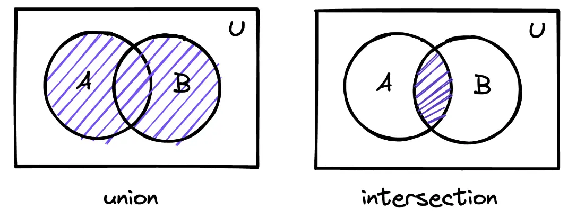

TS也有并运算和交运算，分别是联合类型(Union)和交叉类型(Intersection)。在TS中，联合类型可以将多个类型组合在一个，合并成一个范围更大的类型，多种类型之间使用 `|` 分隔，例如下面代码中的`StringOrNumber`类型，用集合的观点可以解读为：`StringOrNumber`集合 = `string` 集合和`number`集合的并集，所以`StringOrNumber`类型可以同时被`string`类型和`Number`类型赋值。

交叉类型可以将多个类型变成一个范围更小的类型，使用`&`分割，下面代码中定义的`StringAndNumber`类型，可以看成是对应的集合是`string`集合和`number`集合的交集，因为这俩集合没有重合，所以交集是空集，所以可以看到`StringAndNumber`类型是`never类型`（空集）。

```tsx
type StringOrNumber = string | number;
// string | number → both string and number are admissible

type StringAndNumber = string & number;
// never → no type is ever admissible
```

原始类型符合集合的交、并运算，对象类型也同样符合。在下图中，我们用交叉类型创造了范围更小的`t1`类型，范围更小，意味着属性越多，所以`t1`包含了`IPerson1`和`IPerson2`两个类型都有的属性；我们用联合类型创造了范围更大的t2类型，范围更大，意味着属性越少，所以`t2`包含了`IPerson1`和`IPerson2`两个类型共同有的属性`id`。

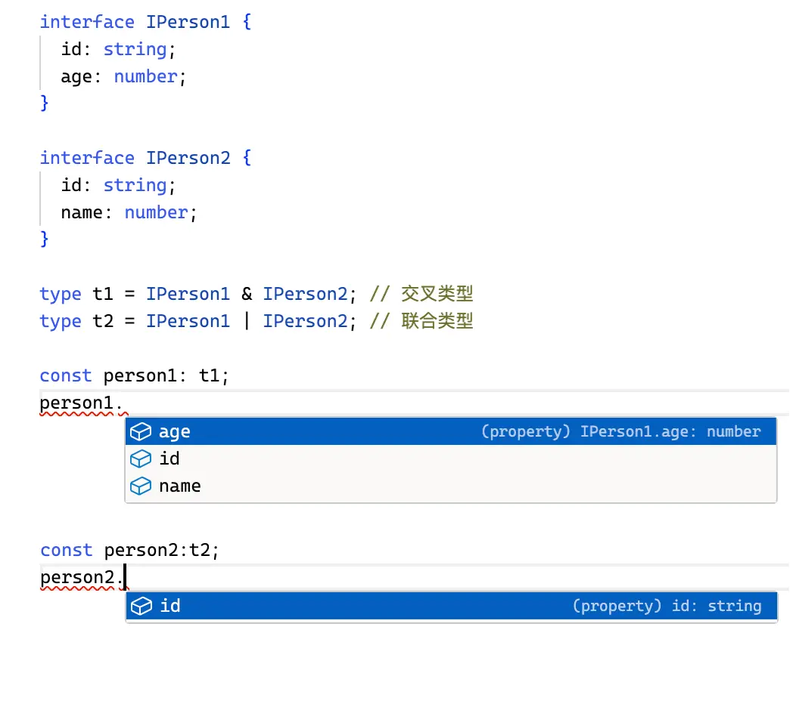

由于TS的`|`和`&`很像JS的逻辑运算`or运算||`和`and运算&&`，如果将C=A | B理解为C类型是A类型或者B类型，D = A & B理解为D类型既满足是A类型，又满足B类型，这种理解方式对于基础类型是适用的，但是无法解释接口类型，因为这种理解方式会给我们相反的结果，例如上图的中的`persion1`，根据合运算和或运算，会得出`person1`的属性为`id`，`person2`的属性为`id, name, age`。

用集合的交集和并集，可以让我们正确地理解联合类型和交叉类型。TS官方文档对[union类型的解读](https://www.typescriptlang.org/docs/handbook/2/everyday-types.html#working-with-union-types)也正好印证了这一点。

> It might be confusing that a *union* of types appears to have the *intersection* of those types’ properties. This is not an accident - the name *union* comes from type theory. The *union* `number | string` is composed by taking the union *of the values* from each type. Notice that given two sets with corresponding facts about each set, only the *intersection* of those facts applies to the *union* of the sets themselves. For example, if we had a room of tall people wearing hats, and another room of Spanish speakers wearing hats, after combining those rooms, the only thing we know about *every* person is that they must be wearing a hat.
>

**理解条件类型**

TS的条件类型是通过`extends`关键字实现的，可以做条件判断和条件限制。

条件判断是`extends ? :`。很像JS的三元运算符。如果条件为`true`则返回`?`后的内容，否则返回`:`后的内容。

```tsx
type R = 'a' extends string ? true : false; // true
type S = 'a' | 'b' extends number ? true : false; // false

type T = { a: 1; b: 2 } extends { a: 1 } ? true : false; // true
type U = { a: 1 } extends { a: 1; b: 2 } ? true : false; // false
```

用集合来看，条件判断很简单，这个条件可以理解为前者是否是后者的子集，例如`A extends B ？C ： D`解读为A是B的子集吗？如果是那么取C， 否则取D。

条件类型的强大之处不是做静态计算，TS支持泛型以及复杂的类型编程，本质上是限制输入类型和变换输出类型。所以条件类型最重要的用法是和泛型一起使用。

如果传入的泛型是一个具体的类型（可以看成一个单独的集合）时，条件类型的结果我们用子集的概念一眼就能看出，如下面这片代码。

```tsx
type isTwo<T> = T extends 2 ? true: false;

type res = isTwo<1>; // false
type res2 = isTwo<2>; // true
type res3 = isTwo<1 | 2>; // boolean

// res3类型等同于下面这种写法：
type res3 = (1 extends 2 ? true : false) | (2 extends 2 ? true : false) 
          = true | false 
          = boolean;
```

但是如果传入的是一个联合类型，情况变得复杂了一点，因为TS默认的运算规则是会把联合类型拆分判断（[Distributive Conditional Types](https://www.typescriptlang.org/docs/handbook/2/conditional-types.html#conditional-type-constraints)）。即 `isTwo<1 |2>` 会被拆分为 `1 extends 2`、`2 extends 2，`最后的结果是拆分后结果的联系类型，所以在下面代码中，`isTwo<1 | 2>`的结果是`boolean`。

TS的这种分配条件规则，可以用集合的分配率来很好地解释：$(B \cup C) \cap A = (B \cap A) \cup (C \cap A)$。我们可以把传入的联合类型看成是公式中的$(B \cup C)$ ，A为`extends`后面的类型，根据分配率扩展后，最终的结果是`B extends A ？X : Y | C extends A ？X : Y`。

如果想要打破TS这种默认分配规则，可以使用元组类型讲泛型看成一个整体，也就是单独一个集合。

```tsx
type isTwo<T> = T extends 2 ? true: false;

type res3 = isTwo<[1 | 2]>; // false
```

理解了集合分配率在TS中的使用，可以思考一下为啥下面的结果是这样：

试试这个 👉👉 [playground](https://www.typescriptlang.org/play?#code/FAFwngDgpgBCCMMC8MCGA7MMoA8RXQBMBnGdAVwFsAjKAJxgH447zYAuGAM1QBtiooSLBAAmZGkzY8BEjAD21AFZQAxiCYs2MTj36Dw0OAGYJGLLnxFSAN3kBLQppCsO3PgKFGQAFjNTLWVJiF3t0AHNNAG9UThC6MPCAGhhqONCIgF8dGCi0mHjEzOBgVXl0EIVldl8AbmBFJQA6YCA) 👈👈

```tsx
type t1 = any extends number ? true : false; // boolean
type t2 = any extends object ? true : false; // boolean
type t3 = any extends void ? true : false; // boolean
type t4 = any extends string ? {a: string, b: string} : {b: string};

// t4的类型是 {
//     a: string;
//     b: string;
//     }
// | {
//     b: string;
//     };

const obj:t4;
obj. // 可以取b类型
```

因为我们前面说过`any`类型可以看成`never`和`unknown`的混合体，也就是空集和全集的并集，因为`never`是任何类型的子集，任何类型是`unknown`的子集，根据集合的分配率，`any extends [A] ? B: C`的结果是`B | C`, `A`为任何类型。

所以我们可以定义自己的union运算方法：

```tsx
type myUion<A, B> = any extends [never] ? A : B; // never类型是随意写的，这里可以替换成任何类型

type t1 = myUion<string, number>; // string | number
```

`extends`的另一种用法是限制输入类型（条件限制），下面代码限制了输入类型T必须是`{ message: unknown }`的子集，所以必须得包含`message`这个属性。

```tsx
type MessageOf<T extends { message: unknown }> = T["message"];
 
interface Email {
  message1: string;
}

type EmailMessageContents = MessageOf<Email>; // 报错：Property 'message' is missing in type 'Email' but required in type '{ message: unknown; }
```

### 理解TS类型断言

此处引用一下[**1.2W字 | 了不起的 TypeScript 入门教程**](https://juejin.cn/post/6844904182843965453?searchId=202308011624346198C61171204F01C9B0#heading-10)的类型断言解释：

> 有时候你会遇到这样的情况，你会比 TypeScript 更了解某个值的详细信息。通常这会发生在你清楚地知道一个实体具有比它现有类型更确切的类型。
>
>
> 通过类型断言这种方式可以告诉编译器，“相信我，我知道自己在干什么”。类型断言好比其他语言里的类型转换，但是不进行特殊的数据检查和解构。它没有运行时的影响，只是在编译阶段起作用。
>

学会了集合论的观点看TS后，我们可以猜测类型断言相当于把一个变量的类型手动转化为`as`之后的新类型，之后这个变量会按照新类型的规则来检查。

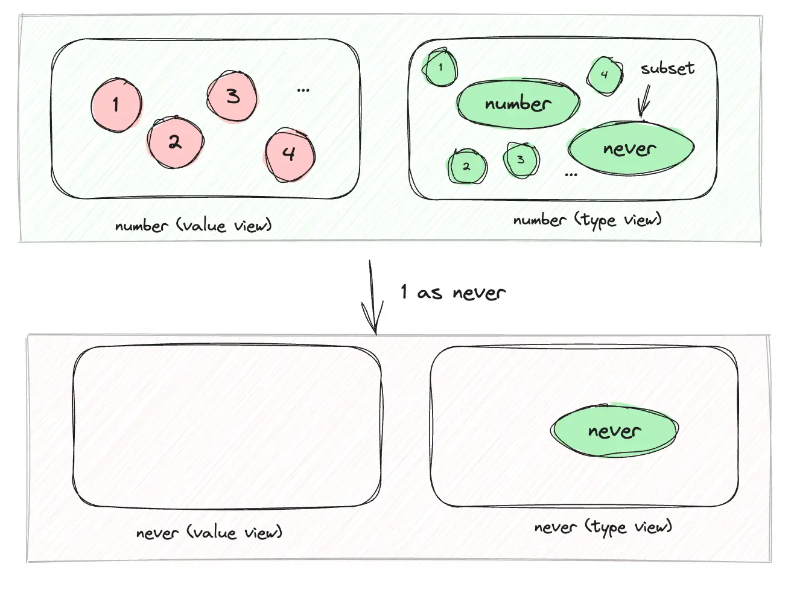

以下代码可以验证我们的想法：

从值集合来看，`v1`的类型已经变为`never`，所以这个变量只能被`never`类型的值赋值，所以`v1`变量不能被赋予任何值；

从类型集合的角度来看，`1`本来是`number`类型，但是类型断言成`never`后，因为`never`是空集，是所有类型的子集，所以`t1`是`true`, `t2`是`false`。

```tsx
let v1 = 1 as never; // never

// value view
const v2 = v1; //v2的类型是never
v1 = true; // Type 'boolean' is not assignable to type 'never'
v1 = 42; // Type 'number' is not assignable to type 'never'
v1 = "Hello World"; // Type 'string' is not assignable to type 'never'.
v1 = []; // Type 'never[]' is not assignable to type 'never'.
v1 = {}; // Type '{}' is not assignable to type 'never'
v1 = Math.random; // Type '() => number' is not assignable to type 'never'
v1 = null; // Type 'null' is not assignable to type 'never'.
v1 = undefined; // Type 'undefined' is not assignable to type 'never'
v1 = new TypeError(); // Type 'TypeError' is not assignable to type 'never'
v1 = Symbol("type"); // Type 'symbol' is not assignable to type 'never'

// type view
type t1 = 1 extends string ? true : false; // false
type t2 = typeof v1 extends string ? true: false; // true
type t3 = typeof v1 extends number ? true: false; // true
type t4 = typeof v1 extends null ? true: false; // true
type t5 = typeof v1 extends undefined ? true: false; // true
type t6 = typeof v1 extends unknown ? true: false; // true
```

### 理解TS类型体操

掌握了集合在TS中的映射，TS类型体操看起来也不是很难理解了。

**Exclude**

`Exclude<T, U>`排除T类型中与U类型的交集部分，生成新的类型。其源码如下所示。可以看到，如果`T`和`U`是一个单个集合类型时（不是联合类型），如果`T`不是`U`的子集，那么返回`T`，否则返回`never`。

```tsx
type Exclude <T, U> = T extends U ? never : T;
type t1 = Exclude<'a'|'b'|'c','a'|'b' >; // 'c'
type t2 = Exclude<number,{}>; // never
type t3 = Exclude<{a: string},{a: string; b: string}>; // {a: string;}
```

如果T是联合类型，需要用分配率来解释。对于t1，我们把U看成一个整体，用A代替，可以用这个公式$(A\cup B) \cap A = (A \cap A) \cup (B \cap A)$ ，因为任何集合是其本身集合的子集，所以根据`exclude`的规则联合左边的结果为`never`，在联合右边，因为B(`c`)不是A(`a|b`)的子集，根据`exclude`的规则，取`B`，所以最终`t1`的结果是`c`。

**IsNever**

判断是否是never类型

```tsx

type IsNever<T> = [T] extends [never] ? true : false
```

never是空集，所以除了本身之外，不可能是任何类型的子集。

本文使用了大量实例探讨了 TS 类型系统中的集合思想，通过类比和映射，我们发现集合论的很多概念与 TS 的类型系统一一对应，这对我们深刻理解和使用TS有很大的帮助，更进一步地，通过揭示TS背后的集合论，我们还能发现计算机科学、数学和逻辑学之间的紧密联系。
