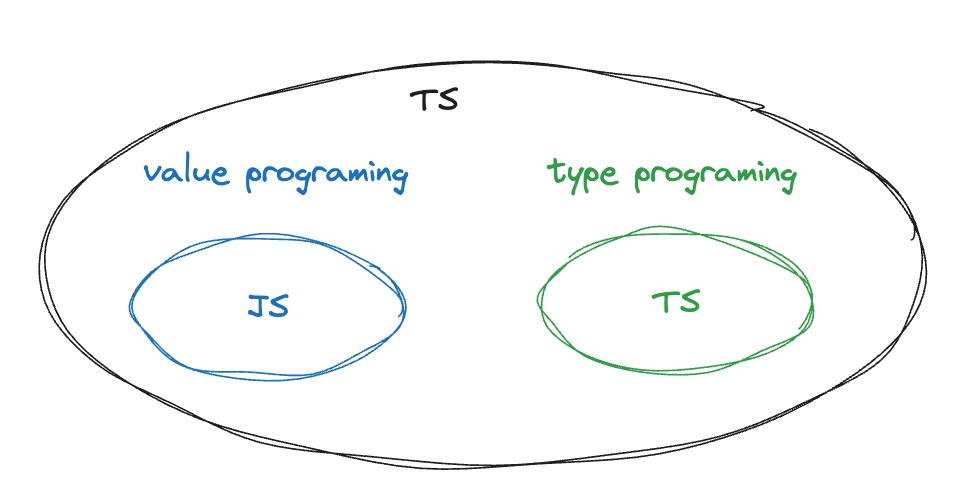

# TS类型编程：类型是一等公民

## 引言

TypeScript（TS）的类型系统十分强大，除了定义了各种类型方便我们对变量、函数、类等进行类型约束，实现类型安全，而且还支持泛型，可以很大程度实现代码复用。另外，为了迎合JS语言的灵活特性，保证更安全的类型检查，TS还提供了很多类型操作符，可以帮助我们实现强大的类型编程，避免`any`类型的滥用。

本文主要讲解TS的类型编程。事实上，在编写TS的时候，我们很容易发现，除了要编写业务本身的复杂逻辑，有的时候类型逻辑写起来也很复杂。如何更好地理解TS类型编程，让TS的类型逻辑不会成为代码编写的负担，是我们很关心的一个问题。

本文的主要观点是将TS看成由两种语言组成：一种是普通的编程语言JS，另一种是类型语言。在JS中，我们的主要操作对象是值，通过声明变量对值进行引用和存储，并使用函数对值进行各种计算、处理和转换。

在类型语言中，我们的关注点从普通编程语言中对值的操作转移到了对类型的操作。通过类型注解和泛型，类型成为一等公民，可以实现类型的赋值、组合和转换，从而产生各种不同的类型。

当我们在编写TS的时候，我们其实是在这两种语言中反复转换：我们用普通的JS语言编写逻辑，处理各种值数据；我们用类型编程创建各种类型，并使用类型注释约束JS中的各种元素。



## 静态类型系统的泛型

在静态类型系统中，泛型是一种参数化类型的机制，意思说我们可以通过将类型看成参数，用一个符号来表示多种类型，从而编写出可以复用的类型代码。

泛型的关键是将类型作为参数（类型参数），传递给代码单元，如函数、类、接口，在其内部，我们使用的是参数化的类型，而不是某一个具体类型。在类型理论中，泛型背后的理论是多态（[**Polymorphism](https://en.wikipedia.org/wiki/Polymorphism_(computer_science)#Row_polymorphism)）**，即通过一个单一的符号来表示多个不同类型，或者通过单一的接口描述不同的数据类型实体。泛型通过参数多态成为实现多态的方式之一。

在没有泛型之前，我们需要多次定义来满足不同类型的情况：

```tsx
type t1 = (a: number) => number;
type t2 = (a: string) => string;

const f1: t1 = (a) => a;
const f2: t2 = (a) => a;
```

有了泛型后，我们使用尖括号（`<>`）和类型参数来定义一个泛型：

```tsx
// 泛型函数1：类似普通函数的定义
const generics_f1 = <T>(a: T): T => a;

// 泛型函数2：泛型类型
const generics_f2: <T>(a: T) => T = (a) => a;

// 泛型函数3：对象字面量形式的泛型类型
const generics_f3: { <T>(a: T): T } = (a) => a;

const f3 = generics_f1<number>;
const f4 = generics_f1<string>;
```

不仅TS的类型系统支持泛型，很多其他编程语言也支持，如Java, C#，GO等，所以对于计算机语言来讲，泛型并不是一个很新的概念。但是TS类型系统提供的能力远远超过一般的泛型，在TS类型编程中，我们可以基于一个类型构建另一个类型，限制类型的范围，甚至对传入的类型参数进行各种逻辑运算。

在上面这片代码中，我们定义的泛型很简单，输入是什么类型，输出就是什么类型，但是对于十分灵活的JS来讲，这种简单的泛型远远不够保证类型安全，因为大部分的场景是这样的：我们输入的类型T，最终需要通过某种逻辑运算，转化成类型U，我们用数学的函数表达式来描述T和U的关系`U=F(U)`.

```tsx
const generics_complex_f: <T>(a: T) => U = (a) => b;
// U = F(T), b = f(a)
```

TS的类型编程主要内容，就是按照TS给定的语言规则，编写`U=F(U)`的代码实现。

## 类型编程与普通编程

普通编程语言中有的思想，在类型编程编程中可以找到类似的实现。

### 类型注解和赋值

在JS中，我们的数据是值，可以通过`=`将数据赋值给变量。在TS中，我们的数据是类型，通过类型注解`:`，可以为变量、函数参数、函数返回值等明确指定类型，从而约束其取值范围和操作。

```tsx
const message: string = "Hello, World!";
```

### 变量声明

JS 使用关键字 `var` 、 `const` 和 `let` 声明一个变量。在TS类型语言中，我们使用`type` 和 `interface` 声明类型变量。

```tsx
let user = {
  name: "Bob",
  login: "robert",
  age: 30,
  comments: [],
};

type User = {
  name: string;
  login: string;
  age: number;
  comments: Comment[];
};
```

**局部变量`infer`**

JS的变量声明具有作用域，类型语言也有作用域，用`type`和`interface`创建的变量具有全局作用域，要创建局部作用域，可以使用`infer`。

```tsx
type A = 'foo'; // 全局作用域
type B = A extends infer C ? (
    C extends 'foo' ? true : false // 局部作用域：C类型变量只在该表达式中有用
) : never
```

在上面这片代码中，类型B的结果可以看成两个过程：

1. 将 `A extends 'foo'` 的结果，通过`infer`缓存在C中
2. 根据`C ? true : false`将结果带入，计算类型B。

### 条件分支

类型语言和JS语言都可以使用三元运算符：`condition ? trueExpression : falseExpression` ，如果条件成立，那么会进入`trueExpression`分支，否则进入`falseExpression`分支。在JS中，判断条件成立可以使用`==`、 `===`或者逻辑运算符。

在类型语言中，使用 `extends` 关键字来判断条件是否成立，`X extends Y` 可以理解为”`X`是`Y`的子集吗？“，如果是，进入`trueExpression`分支，否则进入`falseExpression`分支。

注：对于`X extends Y` ，如果`X`是联合类型，结果会按照分布规则进行计算，这一点可以参考[这篇文章](https://juejin.cn/post/7264549320362934309)更好理解。

```tsx
type R = 'a' extends string ? true : false; // true
type S = 'a' | 'b' extends number ? true : false; // false

type T = { a: 1; b: 2 } extends { a: 1 } ? true : false; // true
type U = { a: 1 } extends { a: 1; b: 2 } ? true : false; // false
```

### 索引：检索属性值和属性类型

在 JS 中，我们可以使用方括号访问对象属性值，例如 `obj['prop']` ，或者根据下标获取数组的值。TS的类型语言也提供了方括号运算符，可以用来获取对象类型的属性类型，或者对元祖和数组进行索引。

```tsx
// 对象
const person = { age: 12; name: 'John'; alive: true };
const Age = person["age"]; // 12

type Person = { age: number; name: string; alive: boolean };
type Age = Person["age"]; // number

// 数组（元祖）
const names = ['John', 'Bob'];
const name1 = names[0] // John

type Names = string[]
type Name = Names[number] // string
type Name1 = Names[1] // string

type Tuple = [string, number]
type Age = Tuple[1] // string
```

对类型语言中，方括号中使用的索引是一个类型（索引类型），这意味着我们可以使用`union`, `keyof`等其他类型操作符对索引类型进行改造，从而获得更多类型。

```tsx
type Person = { age: number; name: string; alive: boolean };
     
type Age = number
type I1 = Person["age" | "name"]; // number | string
      
type I2 = Person[keyof Person]; // number | string | boolean

 
type AliveOrName = "alive" | "name";
type I3 = Person[AliveOrName]; // string | boolean
```

### 泛型和函数

函数是JS等编程语言的核心之一，具有入参和出参，通过传入一些特定值，会根据内部逻辑转化成新的值，并输出。在TS类型语言中，泛型是类型编程中非常重要的概念，它允许我们像JS编写函数一样，编写出能够适用于多种类型的代码。

我们以TS内置的`pick`方法为例，该方法接口两个参数，`T`和`K`，其中`T`一般是一个对象类型，`K`为该类型的某个属性，`pick<T,K>`可以获取T对象中，属性为K的对象转成的新类型：

```tsx
interface Todo {
  title: string;
  description: string;
  completed: boolean;
}
 
type TodoPreview = Pick<Todo, "title" | "completed">; 

// type TodoPreview = {
//     title: string;
//     completed: boolean;
// }
```

在JS中，尝试写一个`pick`函数，入参也是两个，第一个是对象，第二个是对象的属性列表，函数返回值是具有这些属性的新对象，该函数可以写成如下这样：

```tsx
const todo = {
  title: "1",
  description: "1",
  completed: true,
};
const pick = (obj, keys) => keys.map((key) => ({ [key]: obj[key] }));

const res = pick(todo, ["title", "completed"]);

console.log(res); // [ { title: '1' }, { completed: true } ]
```

在类型编程中，需要把所有值看成类型，类型的遍历用`in keyof`操作符，用索引类型获取对应属性的类型，通过`extends`实现属性名的限制，所以类型编程版本的 `pick`方法的实现如下：

```tsx
type Pick<T, K extends keyof T> = {
  [P in K]: T[P];
};
```

**默认参数**

和JS函数参数有默认值一样，TS的类型编程也可以定义一个默认参数：

```tsx
function getName<T=string>(name: T): T {
  return name;
}

let name1 = getName<string>("myString"); // myString
let name2 = getName("myString"); //myString
let name3 = getName<number>(1); // 1
```

### 遍历和过滤

在JS中，我们可以通过`for in` 遍历对象。在遍历的过程中，我们可以修改原数组，例如

```tsx
const obj = {
  name: "John",
  gender: "male",
  age: 23,
};
for (const key in obj) {
  obj[key + "_suffix"] = obj[key];
  delete obj[key];
}
console.log(obj); // { name_suffix: 'John', gender_suffix: 'male', age_suffix: 23 }
```

TS的类型编程则可以通过 `[K in keyof T]` 实现对象类型的遍历，并通过`as` 将遍历后的类型转化为新类型：

```tsx
type Obj = {
  name: string,
  gender: string,
  age: number;
};

type NewObj<T> ={
  [T in keyof Obj as `${T}_suffix`]: Obj[T];
}
 
// type NewObj<T> = {
//     name_suffix: string;
//     gender_suffix: string;
//     age_suffix: number;
// }

```

如果要过滤某些属性，JS可以使用`delete`方法，而在类型编程中，则通过`as`将类型转为`never`实现剔除某些属性。

```tsx
type NewObj1<T> ={
  [T in keyof Obj as Obj[T] extends number ? never : T ]: Obj[T];
}

// type NewObj1<T> = {
//     name: string;
//     gender: string;
// }
```

### 模式匹配

在JS的正则表达式中，括号具有一个很重要的作用，就是用来进行模式提取，可以通过`$1`*、*`$2`*、*`$3` **指代相应的分组，例如下面代码中，`$1`表示第一个分组`\d{4}`，`$2`表示第一个分组`\d{2}`，`$3`表示第一个分组`\d{2}`。通过字符串的`replace`方法，我们可以实现字符串的位置替换。

```tsx
const regex = /(\d{4})-(\d{2})-(\d{2})/;
const string = "2023-08-13";
const result = string.replace(regex, "$2/$3/$1");
```

在TS类型语言中，主要通过`extends`,`infer`以及扩展运算符等组合使用实现模式匹配：

```tsx
type Str = 'foo-bar'
type Bar = Str extends `foo-${infer rest}` ? rest : never // 'bar'

type Arr = [1,2,3,4,5]
type First = Arr extends [infer F, ...infer Rest] ? F : never // 1
type Last = Arr extends [...infer Rest, infer L] ? L : never // 5
type Mid = Arr extends [infer F, ...infer Rest, infer L] ? Rest : never // [2,3,4]
```

通过类型匹配，我们使用TS类型编程来模拟JS中的各种数组和字符串方法。具体举例可以参考[**神光**的掘金小册](https://juejin.cn/book/7047524421182947366?scrollMenuIndex=1)，里面有一个章节是讲模式提取。

### 函数递归

像很多纯函数式编程语言一样，TS的类型语言虽然没有`for`循环实现数据迭代，但是有递归，递归可以代替了循环迭代。

如果用JS，使用递归来实现一个数组的翻转，代码如下：

```tsx
const target = [1, 2, 3, 4, 5];

const reverse = (target, n = target.length, arr = []) => {
  if (arr.length === n) {
    return arr;
  }
  const pre = arr;
  const cur = target[arr.length];
  return reverse(target, n, [cur, ...pre]);
};

const res = reverse(target);
console.log(res); // [5,4,3,2,1]
```

类比到类型编程中，我们使用条件分支、默认参数、递归来实现成等价的类型编码，代码如下：

```tsx
type reverse<
  T extends number[],
  N = T["length"],
  U extends number[] = []
> = U["length"] extends N ? U : reverse<T, N, [T[U["length"]], ...U]>;

type target = [1, 2, 3, 4, 5];
type res1 = reverse<target> // [5,4,3,2,1]
```

看到这里是不是很惊讶，原来TS的类型编码和JS编码其实一模一样，只不是换了一套语法规则！让我们再用斐波那契递归来体验一把。

一个简单的斐波那契数列，其用JS实现的算法如下：

```tsx
const fib = (n) => {
  if (n === 0) return 0;
  if (n === 1) return 1;
  return fib(n - 1) + fib(n - 2);
};

console.log(fib(6)); // 8
```

对应的TS类型编码如下：可以看到类型编码的实现比JS更加复杂一点，因为要实现加减操作，我们需要定义额外的类型实现。在TS的类型编码中，我们可以根据数组类型的`length`获取到数字，然后通过`模式匹配`以及`扩展运算符`实现数组长度的加减，进行实现基本的代数运算。

试试这个 👉👉 [playground](https://www.typescriptlang.org/play?#code/C4TwDgpgBAYglgIwDwBUoQB7AgOwCYDOUOArgLYIQBOAfFALxRqbb5EAMAUFFAPxRceALibosuQlACM3PtNkiAgnjxJ4yAMolkKADTSaNfeqRad+gEyGaAbk6dQkKGdRSxrSaQrV9KC+4kiL0paBigAIRI4ABs8RSoqVzoWQKgAbVkAOmyAQwSpEUiYuITUK10s3ISLETgcADNqKAAlCAJgTgBdWX5W9rSAImjcAHNgAAsB7uFiCAA3ajsHcGhlVRQ3FLZichDffy3PXeo6RgyebMy8qgKIqNj4xI2jSqvqwvuSp6sutIByYY4MbjP6dJaOaBFB6lWQAOXIAW2wR8skeiMkJBwAGscAB7ADuODSnTCxM4pygj0GgOBU3RRHhZDkaI+xUeSEZ+jSUn0l0enVs9ghUCobUYJgAbHQAPTSqAADiAA) 👈👈

```tsx
type Fib<T extends number> = T extends 0
  ? 0
  : T extends 1
  ? 1
  : Add<Fib<Sub<T, 1>>, Fib<Sub<T, 2>>>;

type Sub<T1 extends number, T2 extends number> = BuildArr<T1> extends [
  ...arr1: BuildArr<T2>,
  ...arr2: infer Rest
]
  ? Rest["length"]
  : never;

type Add<T1 extends number, T2 extends number> = [
  ...arr1: BuildArr<T1>,
  ...arr2: BuildArr<T2>
]['length'];

type BuildArr<
  Num extends number,
  Arr extends unknown[] = []
> = Arr["length"] extends Num ? Arr : BuildArr<Num, [1, ...Arr]>;

type res= Fib<6> // 8
```

写到这里，我们见证了TS的类型系统强大的类型编程能力，事实上，TS的潜力远不止上述这些主要的类型操作，目前已经有不少文章证明了TS的类型系统具有[图灵完备](https://itnext.io/typescript-and-turing-completeness-ba8ded8f3de3)（Turing completeness) 特性，一个系统具有图灵完备特性，意味着它可以表达各种算法，实现各种逻辑运算。

所以我们可以理解，TS的类型编程其实已经远远超出了简单的、用一个已知的类型（或者`union`, `intersection`, `record`后的类型)给JS变量进行注解的范围，用TS实现的类型编码确实可以变得异常复杂（但是这种复杂大部分生产环境用不到）。

如果想更近一步探索TS极限类型编程，我觉得[这篇文章](https://www.learningtypescript.com/articles/extreme-explorations-of-typescripts-type-system)很不错，其中列举了用纯TS类型编程实现的应用案例，如模拟一个4比特的虚拟机、SQL数据库引擎、国际象棋等等。

## 结束语

本文主要讲解了TS的泛型和类型编程。通过类比JS这类普通编程语言中的基本特性，我们在TS的类型编程中找到了对应的实现方式。

尽管类型编程比普通编程更复杂，甚至被很戏谑为类型体操，但是这复杂的原因，其实是这种技术JSer们很新鲜，而且不常用。我们接触的大部分语言的类型系统，支持基本的泛型其实就足够了。但是为了契合高度灵活的JS，TS还需要更加灵活的类型编程系统。

另外，使用类型进行编程，比起传统的利用各种API和操作符来实现对数据值的处理，也是一个需要适应的思维转换。
